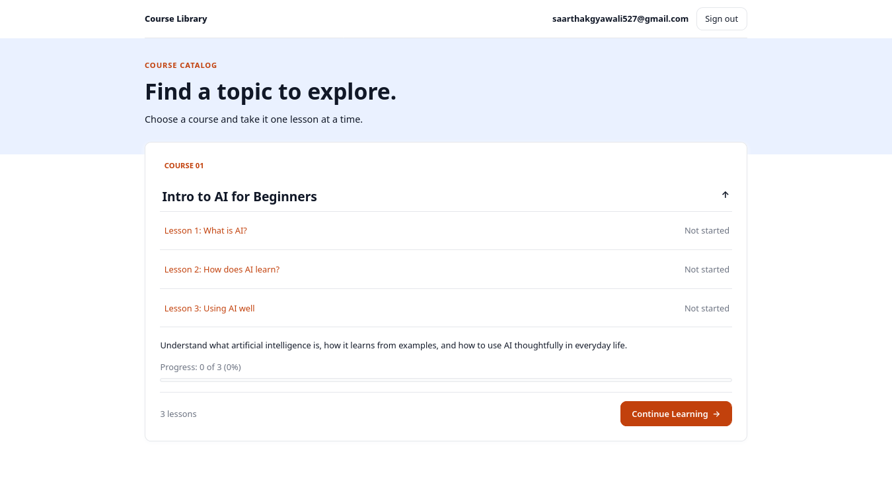
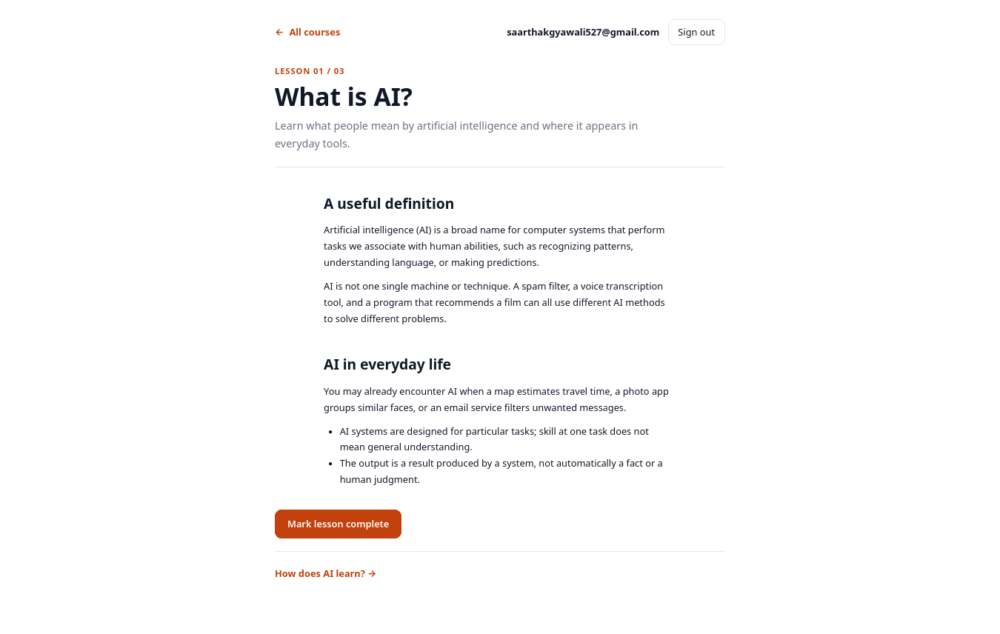
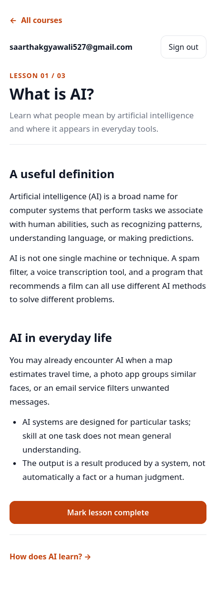
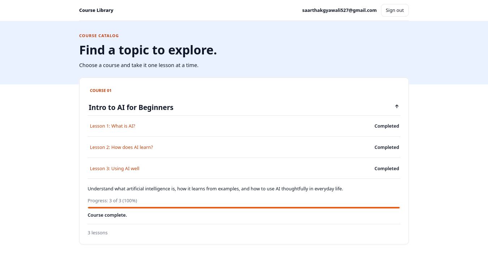

# Mini Learning Course

A small, account-based course site with three introductory AI lessons and saved learner progress.

**Live course:** [https://kilgi.github.io/mini-learning-course](https://kilgi.github.io/mini-learning-course)

## Screenshots

Add screenshots at these paths:









## Features

- Sign up and sign in with Supabase Auth.
- Read three AI lessons and move between them.
- Save completion per learner and continue at the earliest unfinished lesson.
- See progress as lesson counts and a percentage; submit feedback after completing all lessons.
- Use the admin page to update course content or clear course progress and feedback.
- Fall back to bundled lesson content if the saved content cannot be read.

## Technology

- HTML, CSS, and browser JavaScript; no build step or frontend framework.
- Supabase JavaScript client, Auth, and PostgreSQL with row-level security (RLS).
- GitHub Pages for the live static site.
- VS Code Live Server for local development.

## Setup

### Run locally

1. Open this project folder in VS Code.
2. Install the **Live Server** extension by Ritwick Dey if it is not already installed.
3. In the Explorer, right-click `login.html` and choose **Open with Live Server**, or select **Go Live** in the status bar. The site should open at a local address such as `http://127.0.0.1:5500/login.html`.
4. Complete the Supabase setup below before trying to sign in. Without Supabase configuration, sign-in is disabled.

### Create and configure Supabase

1. Create a project on the [Supabase dashboard](https://supabase.com/dashboard). The free plan is sufficient to get started. Enable Email authentication under **Authentication > Providers**.
2. In **Project Settings > API** (the API Keys page in some dashboard versions), copy the **Project URL** and the public **publishable** key or legacy **anon** key.
3. In `js/supabase-config.js`, set the two constants to your own project values:

	```js
	const SUPABASE_URL = "YOUR_SUPABASE_PROJECT_URL";
	const SUPABASE_ANON_KEY = "YOUR_PUBLIC_PUBLISHABLE_OR_ANON_KEY";
	```

	These are placeholders, not working credentials. Do not use a service-role or secret key in browser code.

4. Open `docs/supabase-setup.md`. In the Supabase **SQL Editor**, run each SQL code block in that file to create the progress, feedback, and course-content tables and their learner policies. Do not paste the Markdown prose into the SQL Editor.
5. After all three tables exist, run the complete `docs/security-fix.sql` script in the SQL Editor. This applies the final RLS policies and constraints, including the admin-only policies.
6. In **Authentication > URL Configuration**, set **Site URL** to `https://kilgi.github.io/mini-learning-course/`. Add these **Redirect URLs**:

	```text
	https://kilgi.github.io/mini-learning-course/**
	http://127.0.0.1:5500/**
	http://localhost:5500/**
	```

	The local entries allow email-confirmation links during Live Server testing. Use HTTPS for the deployed site.

7. In **Authentication > Users**, create the admin user. In its trusted dashboard app-metadata editor, set `app_metadata` to include:

	```json
	{ "role": "admin" }
	```

	The role must be in **app metadata**, not user metadata. Confirm the account if email confirmation is enabled, then sign out and back in so the role claim refreshes. Keep the account's real email and password out of this repository.
8. Open the local or live sign-in page and create a learner account to try the course.

## Project structure

```text
.
├── admin.html
├── index.html
├── lesson-1.html
├── lesson-2.html
├── lesson-3.html
├── login.html
├── css/
│   └── style.css
├── docs/
│   ├── security-fix.sql
│   └── supabase-setup.md
├── js/
│   ├── admin.js
│   ├── app.js
│   ├── auth.js
│   ├── data.js
│   ├── lesson.js
│   ├── login.js
│   ├── storage.js
│   └── supabase-config.js
├── DESIGN.md
└── TESTING.md
```

The screenshot links above are placeholders until the four image files are added to `docs/`.

## Security

The browser uses only the Supabase public publishable/anon key; it is public by design, so database access must be protected by RLS. Never put a service-role/secret key, real passwords, or private learner data in this repository. RLS limits learner progress and feedback to the signed-in user's UUID. Authenticated users can read course content; only users with the trusted `app_metadata.role = 'admin'` claim can edit it or perform admin resets. The client-side admin check controls the page UI, but database RLS is the security boundary. See [docs/supabase-setup.md](docs/supabase-setup.md) for details.

## More information

- [System design](DESIGN.md)
- [Manual testing checklist](TESTING.md)